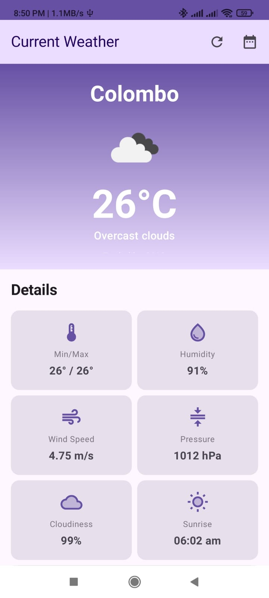
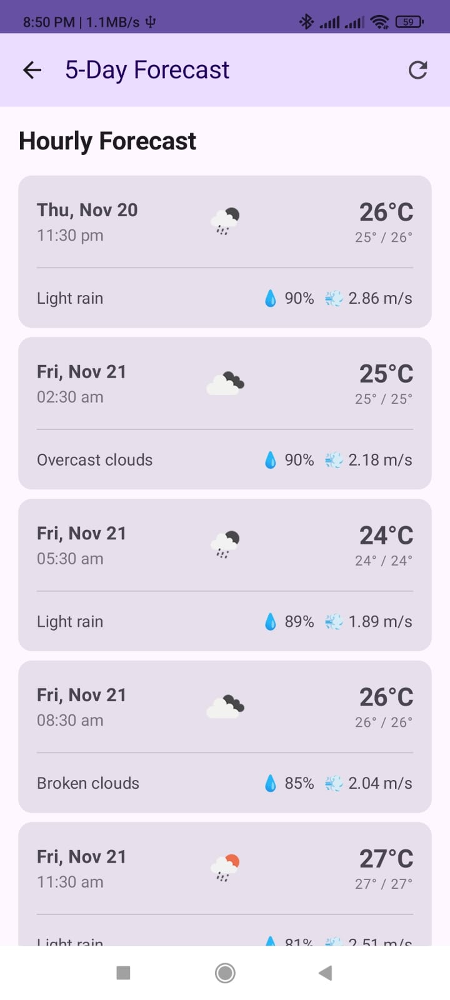

# 🌤️ Weather Forecast App

[](https://developer.android.com)
[](https://kotlinlang.org)
[](https://developer.android.com/jetpack/compose)
[](LICENSE)

A modern, production-ready Android weather forecast application showcasing industry best practices including **Clean Architecture**, **MVVM**, **Jetpack Compose**, **Coroutines**, **Flow**, **Room**, **Retrofit**, and **Hilt**.

## 📸 Screenshots

<p align="center">
  
  
  
</p>

> **Note**: Add actual screenshots to `/screenshots` folder after running the app

## ✨ Features

### Core Features
- 🌡️ **Real-time Weather Data** - Current weather conditions with detailed metrics
- 📅 **5-Day Forecast** - Hourly weather predictions
- 📍 **Location-Based** - Automatic location detection
- 💾 **Offline Support** - Cached data available without internet
- 🌓 **Dark Mode** - Material Design 3 with dynamic theming
- 🔄 **Pull to Refresh** - Manual data refresh capability

### Technical Features
- ✅ **Clean Architecture** - Separation of concerns across layers
- ✅ **MVVM Pattern** - Reactive UI with StateFlow
- ✅ **Jetpack Compose** - Modern declarative UI
- ✅ **Coroutines & Flow** - Asynchronous programming
- ✅ **Room Database** - Local caching with offline-first approach
- ✅ **Retrofit** - Type-safe HTTP client
- ✅ **Hilt** - Dependency injection
- ✅ **Repository Pattern** - Single source of truth
- ✅ **Use Cases** - Encapsulated business logic
- ✅ **StateFlow** - Reactive state management
- ✅ **Navigation Compose** - Type-safe navigation
- ✅ **Material Design 3** - Modern UI components
- ✅ **CI/CD Pipeline** - Automated testing and deployment
- ✅ **Unit Tests** - ViewModel and UseCase testing
- ✅ **Instrumentation Tests** - UI testing with Compose

## 🏗️ Architecture

The app follows **Clean Architecture** principles with three main layers:
```
┌─────────────────────────────────────────┐
│         Presentation Layer              │
│  • ViewModels (State Management)        │
│  • Compose UI (Declarative UI)          │
│  • Navigation (Screen routing)          │
└─────────────────┬───────────────────────┘
                  │
┌─────────────────▼───────────────────────┐
│          Domain Layer                   │
│  • Use Cases (Business Logic)           │
│  • Domain Models (Pure Kotlin)          │
│  • Repository Interfaces                │
└─────────────────┬───────────────────────┘
                  │
┌─────────────────▼───────────────────────┐
│           Data Layer                    │
│  • Repository Implementations           │
│  • Remote Data Source (Retrofit)        │
│  • Local Data Source (Room)             │
│  • DTOs & Entities                      │
└─────────────────────────────────────────┘
```

### Data Flow
```
User Action → ViewModel → UseCase → Repository → [API | Database]
                ↓            ↓           ↓              ↓
            StateFlow ← Domain Model ← Mapping ← [DTO | Entity]
                ↓
            Compose UI
```

## 📁 Project Structure
```
app/
├── data/
│   ├── local/
│   │   ├── WeatherDatabase.kt
│   │   ├── WeatherDao.kt
│   │   └── entity/
│   │       └── WeatherEntity.kt
│   ├── remote/
│   │   ├── WeatherApi.kt
│   │   └── dto/
│   │       ├── WeatherResponse.kt
│   │       └── ForecastResponse.kt
│   └── repository/
│       └── WeatherRepositoryImpl.kt
│
├── domain/
│   ├── model/
│   │   ├── Weather.kt
│   │   └── Forecast.kt
│   ├── repository/
│   │   └── WeatherRepository.kt
│   └── usecase/
│       ├── GetCurrentWeatherUseCase.kt
│       ├── GetForecastUseCase.kt
│       └── RefreshWeatherUseCase.kt
│
├── presentation/
│   ├── weather/
│   │   ├── WeatherViewModel.kt
│   │   ├── WeatherScreen.kt
│   │   └── WeatherState.kt
│   ├── forecast/
│   │   ├── ForecastViewModel.kt
│   │   ├── ForecastScreen.kt
│   │   └── ForecastState.kt
│   ├── components/
│   │   ├── WeatherCard.kt
│   │   └── ForecastItem.kt
│   ├── navigation/
│   │   └── NavGraph.kt
│   └── theme/
│       ├── Color.kt
│       ├── Theme.kt
│       └── Type.kt
│
├── di/
│   ├── AppModule.kt
│   ├── NetworkModule.kt
│   └── DatabaseModule.kt
│
└── util/
    ├── Resource.kt
    └── Constants.kt
```

## 🛠️ Tech Stack

### Core
| Technology | Description |
|-----------|-------------|
| [Kotlin](https://kotlinlang.org/) | Programming language |
| [Jetpack Compose](https://developer.android.com/jetpack/compose) | Modern declarative UI toolkit |
| [Coroutines](https://kotlinlang.org/docs/coroutines-overview.html) | Asynchronous programming |
| [Flow](https://kotlinlang.org/docs/flow.html) | Reactive streams |

### Architecture Components
| Component | Purpose |
|-----------|---------|
| [ViewModel](https://developer.android.com/topic/libraries/architecture/viewmodel) | UI state management |
| [Room](https://developer.android.com/training/data-storage/room) | Local database |
| [Navigation Compose](https://developer.android.com/jetpack/compose/navigation) | Navigation |
| [StateFlow](https://kotlinlang.org/api/kotlinx.coroutines/kotlinx-coroutines-core/kotlinx.coroutines.flow/-state-flow/) | State management |

### Networking
| Library | Purpose |
|---------|---------|
| [Retrofit](https://square.github.io/retrofit/) | REST API client |
| [OkHttp](https://square.github.io/okhttp/) | HTTP client |
| [Gson](https://github.com/google/gson) | JSON parsing |

### Dependency Injection
| Library | Purpose |
|---------|---------|
| [Hilt](https://dagger.dev/hilt/) | Dependency injection |

### Testing
| Framework | Purpose |
|-----------|---------|
| [JUnit](https://junit.org/junit4/) | Unit testing |
| [Mockk](https://mockk.io/) | Mocking |
| [Turbine](https://github.com/cashapp/turbine) | Flow testing |
| [Espresso](https://developer.android.com/training/testing/espresso) | UI testing |
| [Truth](https://truth.dev/) | Assertions |

### Tools
| Tool | Purpose |
|------|---------|
| [Timber](https://github.com/JakeWharton/timber) | Logging |
| [Coil](https://coil-kt.github.io/coil/) | Image loading |
| [LeakCanary](https://square.github.io/leakcanary/) | Memory leak detection |

## 🚀 Getting Started

### Prerequisites

- Android Studio Hedgehog (2023.1.1) or later
- JDK 17
- Android SDK 36
- Minimum SDK 26 (Android 8.0)

### Installation

1. **Clone the repository**
```bash
   git clone https://github.com/YOUR_USERNAME/weather-forecast-app.git
   cd weather-forecast-app
```

2. **Get OpenWeatherMap API Key**
   - Visit [OpenWeatherMap API](https://openweathermap.org/api)
   - Sign up for a free account
   - Generate an API key
   - **Note**: New API keys may take 2-10 hours to activate

3. **Configure API Key**
   - Copy `secrets.properties.template` to `secrets.properties`
```bash
   cp secrets.properties.template secrets.properties
```
   - Open `secrets.properties` and add your API key:
```properties
   WEATHER_API_KEY=your_actual_api_key_here
```

4. **Build the project**
```bash
   ./gradlew build
```

5. **Run the app**
```bash
   ./gradlew installDebug
```
   Or use Android Studio's Run button ▶️

### Verifying Your Setup

Test your API key in browser:
```
https://api.openweathermap.org/data/2.5/weather?lat=6.9271&lon=79.8612&appid=YOUR_API_KEY&units=metric
```

You should see JSON weather data if everything is configured correctly.

## 🧪 Testing

### Run Unit Tests
```bash
./gradlew testDebugUnitTest
```

### Run Instrumentation Tests
```bash
./gradlew connectedDebugAndroidTest
```

### Run All Tests
```bash
./gradlew test connectedAndroidTest
```

### Generate Coverage Report
```bash
./gradlew testDebugUnitTestCoverage
```
Report location: `app/build/reports/coverage/test/debug/index.html`

### Run Lint Checks
```bash
./gradlew lintDebug
```

## 📦 Build & Release

### Debug Build
```bash
./gradlew assembleDebug
```
Output: `app/build/outputs/apk/debug/app-debug.apk`

### Release Build
```bash
./gradlew assembleRelease
```
Output: `app/build/outputs/apk/release/app-release.apk`

### Android App Bundle (for Play Store)
```bash
./gradlew bundleRelease
```
Output: `app/build/outputs/bundle/release/app-release.aab`

## 🔄 CI/CD Pipeline

The project includes automated CI/CD pipelines:

### GitLab CI
- **Build**: Compile and assemble APK
- **Lint**: Code quality checks
- **Unit Tests**: Run JUnit tests
- **Instrumentation Tests**: UI testing
- **Deploy**: Release to Play Store (manual trigger)

Configuration: `.gitlab-ci.yml`

### GitHub Actions
Same stages as GitLab CI

Configuration: `.github/workflows/android.yml`

### Pipeline Status
[]()
[]()
[]()

## 🎨 Design Patterns

- **MVVM (Model-View-ViewModel)** - Separation of UI and business logic
- **Repository Pattern** - Single source of truth for data
- **Use Case Pattern** - Encapsulated business logic
- **Observer Pattern** - StateFlow for reactive updates
- **Dependency Injection** - Loose coupling with Hilt
- **Factory Pattern** - ViewModel creation
- **Strategy Pattern** - Different data sources (API/DB)

## 📱 Key Features Explained

### Offline-First Architecture
```kotlin
// Repository checks cache first, then fetches from API
fun getCurrentWeather(): Flow<Resource<Weather>> = flow {
    // 1. Emit cached data immediately
    val cached = dao.getWeather()
    emit(Resource.Success(cached))
    
    // 2. Fetch fresh data from API
    val fresh = api.getCurrentWeather()
    dao.insertWeather(fresh)
    emit(Resource.Success(fresh))
}
```

### Reactive State Management
```kotlin
// ViewModel exposes StateFlow
class WeatherViewModel @Inject constructor(
    private val useCase: GetCurrentWeatherUseCase
) : ViewModel() {
    
    private val _state = MutableStateFlow<WeatherState>(WeatherState.Loading)
    val state: StateFlow<WeatherState> = _state.asStateFlow()
    
    init {
        loadWeather()
    }
}

// UI collects state reactively
@Composable
fun WeatherScreen(viewModel: WeatherViewModel) {
    val state by viewModel.state.collectAsState()
    
    when(state) {
        is Loading -> LoadingScreen()
        is Success -> WeatherContent(state.data)
        is Error -> ErrorScreen(state.message)
    }
}
```

### Error Handling
```kotlin
sealed class Resource<T> {
    class Success<T>(val data: T) : Resource<T>()
    class Error<T>(val message: String) : Resource<T>()
    class Loading<T> : Resource<T>()
}
```

## 🤝 Contributing

Contributions are welcome! Please follow these steps:

1. Fork the repository
2. Create a feature branch (`git checkout -b feature/AmazingFeature`)
3. Commit your changes (`git commit -m 'Add some AmazingFeature'`)
4. Push to the branch (`git push origin feature/AmazingFeature`)
5. Open a Pull Request

### Coding Standards
- Follow [Kotlin Coding Conventions](https://kotlinlang.org/docs/coding-conventions.html)
- Write meaningful commit messages
- Add unit tests for new features
- Update documentation as needed

## 📄 License

This project is licensed under the MIT License - see the [LICENSE](LICENSE) file for details.
```
MIT License

Copyright (c) 2025 Drew

Permission is hereby granted, free of charge, to any person obtaining a copy
of this software and associated documentation files (the "Software"), to deal
in the Software without restriction...
```

## 👨‍💻 Author

**Drew**
- 5+ years of Mobile Development experience (Android, iOS, Flutter)
- Clean Architecture & MVVM enthusiast
- Expertise in Kotlin, Jetpack Compose, Coroutines, Flow
- Proven track record with enterprise-level deployments (500+ devices)

## 🌟 Acknowledgments

- [OpenWeatherMap API](https://openweathermap.org/api) - Weather data provider
- [Android Developers](https://developer.android.com/) - Official documentation
- [Jetpack Compose Samples](https://github.com/android/compose-samples) - UI inspiration
- [Now in Android](https://github.com/android/nowinandroid) - Architecture reference


## 🔮 Future Enhancements

- [ ] Weather alerts and notifications
- [ ] Multiple location support
- [ ] Weather widgets
- [ ] Share weather updates
- [ ] Historical weather data
- [ ] Weather maps integration
- [ ] Voice search
- [ ] Wear OS support

---

**⭐ If you found this project helpful, please give it a star!**

---

*This is a portfolio project demonstrating production-ready Android development practices.*
